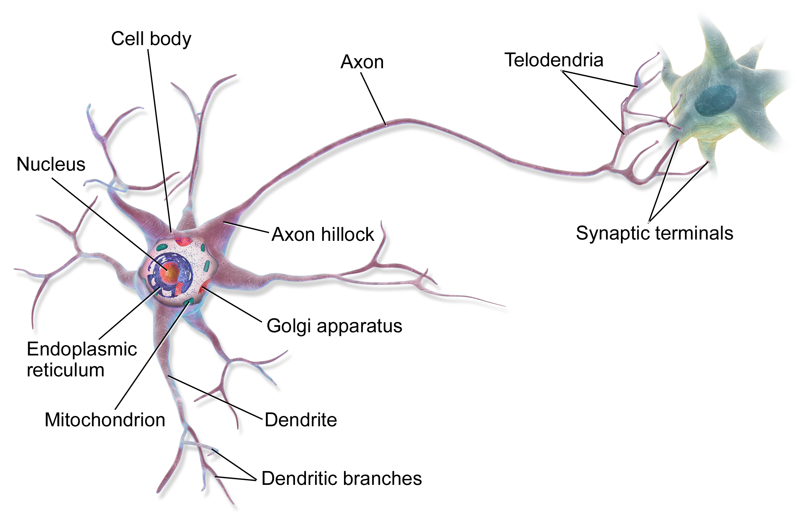
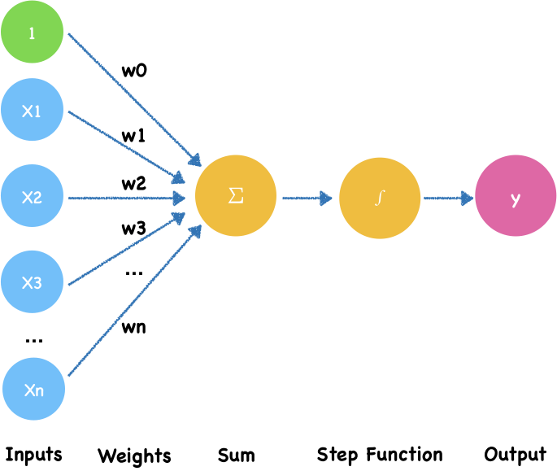

---
redirect_from:
  - "/02/perceptron"
interact_link: content/02/Perceptron.ipynb
kernel_name: python3
has_widgets: false
title: 'Foundation block of Neural Network—Perceptron'
prev_page:
  url: /02/Intro
  title: '2. Perceptron'
next_page:
  url: /02/Iris
  title: 'Iris Classification'
comment: "***PROGRAMMATICALLY GENERATED, DO NOT EDIT. SEE ORIGINAL FILES IN /content***"
---

# Perceptron: foundation block of Neural Network

A perceptron is a simple binary classification algorithm, proposed in 1958 at the Cornell Aeronautical Laboratory by Frank Rosenblatt. 

It's the most fundamental unit of a deep neural network (also called an artificial neuron), which is developed on biological "neuron models" that conceptually resemble the mechanisms by which real biological neurons transmit signals.

## Neurons and Perceptron

Let’s first look at the basic unit of a biological brain —— the neuron.





In a neuron, the dendrite receives electrical signals from the axons of other neurons. In the perceptron, these electrical signals are represented as numerical **input values**, $x_1,x_2, x_3,...,x_n$.

At the synapses between the dendrite and axons, electrical signals are modulated in various amounts. In the perceptron, this corresponds to each of input value is multiplied by a specific value called the **weight**, $w_0, w_1, w_2,...,w_n$.

Finally, a neuron **triggers** an output only when the total strength of the input signals exceeds a certain **threshold**. 

A threshold is like the capacity of a water cup. The cup overflows only when it is filled. It's because neurons don't want to transmit small interfering signals, only strong ones do.

This is simulated by calculating the weighted **sum of the inputs**, $ z = w_0 + w_1x_1 + w_2x_2 + ... + w_nx_n$, and applying a **step function** $f(z)$ on the sum to determine its output $y$. 

$$
y=\left\{
\begin{array}{rcl}
0       &      & {w_0 + w_1x_1 + w_2x_2 + ... + w_nx_n > 0}\\
1     &      & {w_0 + w_1x_1 + w_2x_2 + ... + w_nx_n\leq 0}\\
\end{array} \right.
$$


The simple step function we use may look like this:


{:.input_area}
```python
import matplotlib.pyplot as plt

plt.xlabel("Input")
plt.ylabel("Output")

plt.plot([0,3,3,5],[0,0,1,1])
plt.ylim(-0.1,1.1)

plt.show()
```


{:.output .output_data_text}
```
<Figure size 640x480 with 1 Axes>
```


The threshold value is 3. When the input less than 3, the output is 0. Once the threshold input is reached, output jumps to 1.

## Powerful neurons

It's worth noting that, historically, the perceptron model is originally inspired by neurons. However, they are very different now. Researchers have discovered there is a great deal of computational capacity within a single neuron. The ability of single neurons to perform complex tasks, perhaps as complex as person recognition, indicates that the neuron, in fact, contains far more internal structure than the perceptron model suggests. This could again provide a door to new forms of AI.

## Summary

In this section, we introduced perceptron. This is the basic building block for building a neural network, like the bricks of a house. In the next section, we will implement a perceptron using a classification example.

## Reference

- [Neuron](https://en.wikipedia.org/wiki/Neuron)
- [Perceptron](https://en.wikipedia.org/wiki/Perceptron)
- [15-859(B) Machine Learning Theory](https://www.cs.cmu.edu/~avrim/ML10/lect0125.pdf)
- [The perceptron](https://cs.stanford.edu/people/eroberts/courses/soco/projects/neural-networks/Neuron/index.html)
- [the-artificial-neuron-at-the-core-of-deep-learning](https://missinglink.ai/guides/neural-network-concepts/perceptrons-and-multi-layer-perceptrons-the-artificial-neuron-at-the-core-of-deep-learning/)

## Exercise

1. What is Perceptron?
2. What is step function?
