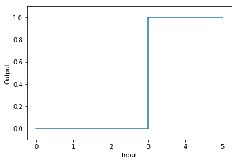
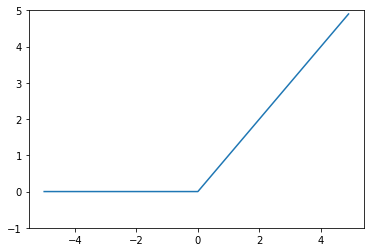
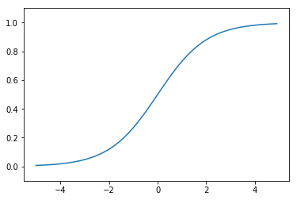
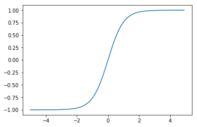

---
redirect_from:
  - "/03/activatefunction"
interact_link: content/03/ActivateFunction.ipynb
kernel_name: python3
has_widgets: false
title: 'Activate Function'
prev_page:
  url: /03/MultilayerPerceptron
  title: 'Multilayer Perceptron'
next_page:
  url: /03/ForwardPropagation
  title: 'Forward Propagation'
comment: "***PROGRAMMATICALLY GENERATED, DO NOT EDIT. SEE ORIGINAL FILES IN /content***"
---

# Activate function

## What is activate function?

Recall that we use a step function in perceptron to transform output i.e. whether or not the neuron should be activated. We call this kind of function which take all the inputs to transform an output as **activate function**. 
Activate function is one of the key concepts in deep learning. Let's first take a brief look at some common activation functions.

## Common used active function

### Step Function

The definition of step function is:


$$
h(x)=\left\{
\begin{array}{rcl}
1       &      & {x > 0}\\
0     &      & {x\leq 0}\\
\end{array} \right.
$$

Here we use Python to implement step function:


{:.input_area}
```python
def step_func(x):
    if x > 0:
        return 1
    else:
        return 0
```


In the above implementation, $x$ is an input number. Later we will use a vector as input, so we can implement this using Numpy.

Input $x$ as a vector:


{:.input_area}
```python
def step_func(x):
    # for each element in x, determine weather it positive
    # return the result as int array type
    return np.array(x > 0, dtype=np.int)
```


Here is how this step function looks like:


{:.input_area}
```python
import matplotlib.pyplot as plt
%matplotlib inline

plt.xlabel("Input")
plt.ylabel("Output")

plt.plot([0,3,3,5],[0,0,1,1])
plt.ylim(-0.1,1.1)

plt.show()
```


{:.output .output_png}



###  ReLU Function

The definition of ReLU(rectified linear unit) function is:

$$h(x) = max(x,0)$$

This means that the ReLU function only remain positive elements and setting all negative elements nodes to 0. It provides a very simple nonlinear transformation.

Here we use python to implement ReLU function:


{:.input_area}
```python
import numpy as np
def relu(x):
    # return the maxium number bwtween 0 an each element of vector x
    return np.maximum(0, x)
```


Let's plot it.


{:.input_area}
```python
x = np.arange(-5.0, 5.0, 0.1)
y = relu(x)

plt.plot(x, y)
plt.ylim(-1.0, 5)
plt.show()
```


{:.output .output_png}



### Sigmoid Function

The definition of sigmoid function is:

$$ h(x) =  \frac{\mathrm{1} }{\mathrm{1} + e^{-x} }  $$ 

The letter e is a mathematical constant approximate 2.71828.

The implementation of sigmoid function in Python:


{:.input_area}
```python
def sigmoid(x):
    return 1 / (1 + np.exp(-x))
```


Sigmoid function is a S-shaped function.


{:.input_area}
```python
X = np.arange(-5.0, 5.0, 0.1)
Y = sigmoid(X)
plt.plot(X, Y)
plt.ylim(-0.1, 1.1)
plt.show()
```


{:.output .output_png}



### TancH function


{:.input_area}
```python
# TancH function
def tanh(x):
    return np.tanh(x)
```


{:.input_area}
```python
X = np.arange(-5.0, 5.0, 0.1)
Y = tanh(X)
plt.plot(X, Y)
plt.ylim(-1.1, 1.1)
plt.show()
```


{:.output .output_png}



All the activate function we introduced are none-linearities function. Why activate function must to be non-linearities function? Generally speaking, the purpose of activation functions is to introduce non-linearities into the network. Next section, we will deep into Forward Propagation. And then the detailed explanation of why we must use none-linearities will be discussed.
