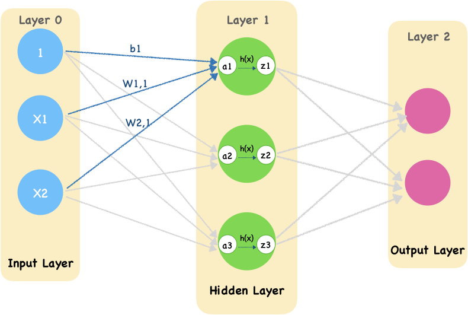

---
redirect_from:
  - "/03/forwardpropagation"
interact_link: content/03/ForwardPropagation.ipynb
kernel_name: python3
has_widgets: false
title: 'Forward Propagation'
prev_page:
  url: /03/MultilayerPerceptron
  title: 'Multilayer Perceptron'
next_page:
  url: 
  title: ''
comment: "***PROGRAMMATICALLY GENERATED, DO NOT EDIT. SEE ORIGINAL FILES IN /content***"
---

# Forward Propagation

Now we get familiar with the deep feedforward networks's structure, we are going to learn how the single pass through the neuron.




Here the value of input $x_1$ and $x_2$ are:

$x_1 = 0.2$

$x_2 = 0.8$


{:.input_area}
```python
x1 = 0.2
x2 = 0.8
```


We start with some random weights and bias:

$b_1 = 0.4$

$w{1,1} = 1$

$w{1,2} = 0.7$

$w{1,3} = 0.34$

$w{2,1} = 0.5$

$w{2,2} = 0.8$

$w{2,3} = 0.6$


{:.input_area}
```python
b1 = 0.4 
w11 =1.0
w12 = 0.7
w13 = 0.34
w21 = 0.5
w22 = 0.8
w23 = 0.6
```


Here we use sigmod function as activate function.


{:.input_area}
```python
import numpy as np
def sigmoid(x):
    return 1 / (1 + np.exp(-x))
```


The first layer of nodes is input layer which doing nothing but input signals. Notice that we add a bias node which weight is $b_1$.

Move to the second layer, let's calculate input of first node. The same with perceptron, we 

$$a_1 = w_{1,1}x_1+w_{2,1}x_2 + b_1$$

The input nodes have values of 0.2 and 0.8. The weight of bias node in input layer and the first node in hidden layer is 0.4. The weight from second node in input layer is 0.1. The link weight from third node is 0.5. So the combined $a_1$ input is:

$a_1 = 1 * 0.2 + 0.5 * 0.8 + 0.4$

$a_1 = 0.2 + 0.4 + 0.4$

$a_1 =1$


{:.input_area}
```python
a1 = w11 * x1 + w21 * x2 + b1
print(a1)
```


{:.output .output_stream}
```
1.0

```

Then we calculate the output of this node using activate function $h(x) = sigmod(x)$.

$z_1 = sigmod(a_1)$

$ z_1 =  \frac{\mathrm{1} }{\mathrm{1} + e^{-1.1} }  $

$z_1 = 0.7502601055951177$


{:.input_area}
```python
z1 = sigmoid(a1)
print(z1)
```


{:.output .output_stream}
```
0.7310585786300049

```

Cool! We have finished calculate the first node's output. 

The remaining two nodes can be calculated with the same way.

The second node of hidden layer:

$a_2 = w_{1,2}x_1+w_{2,2}x_2 + b_1$

$a_2 = 0.7 * 0.2 + 0.8* 0.8 + 0.4 = 1.1800000000000002$

$z_2 = sigmod(a_2) = 0.7649478037637648$


{:.input_area}
```python
a2 = w12 * x1 + w22 * x2 + b1
print(a2)
```


{:.output .output_stream}
```
1.1800000000000002

```


{:.input_area}
```python
z2 = sigmoid(a2)
print(z2)
```


{:.output .output_stream}
```
0.7649478037637648

```

The third node of hidden layer:

$a_3 = w_{1,3}x_1+w_{2,3}x_2 + b_1$

$a_3 = 0.34 * 0.2 + 0.6 * 0.8 + 0.4 = 0.9480000000000001$

$z_3 = sigmod(a_3) = 0.7207127840500688$


{:.input_area}
```python
a3 = w13 * x1 + w23 * x2 + b1
print(a3)
```


{:.output .output_stream}
```
0.9480000000000001

```


{:.input_area}
```python
z3 = sigmoid(a3)
print(z3)
```


{:.output .output_stream}
```
0.7207127840500688

```

For each node we need to write the corresponding calculation formula, now we just handwritten three nodes, you are likely to get the wrong index. In the future, our network will become more and more complex, and there may be hundreds or thousands of nodes. If we still use such a way, it would be difficult to ensure that nothing goes wrong, isn't it?

So how do we simplify this? Actually using the matrix in mathematics can simplify and speed up the node's calculation of the computer. Let's see what's going on.

## Matrix

In mathematics, a **matrix** (plural: **matrices**) is a table, a rectangular array of numbers, symbols, or expressions, arranged in rows and columns. In python, we can use two-dimensional array to represent it.

For example, the dimension of the matrix below is 2 by 3, because there are two rows and three columns:


In Python, we usually use Numpy to represent and evaluate matrices.


{:.input_area}
```python
A = np.array([[2,4,5],[3,7,9]])
```


We use ndim funcation to get the dimension of the matrix:


{:.input_area}
```python
np.ndim(A)
```


{:.output .output_data_text}
```
2
```


Shown as the ouput, this is a two dimension matrix.

And we can use shape function to get shape:


{:.input_area}
```python
A.shape
```


{:.output .output_data_text}
```
(2, 3)
```


This is a 2 by 3 array matrix. 2 represent the number of rows, which means the first dimension has 2 elements. 3 represent the number of columns, which means the second dimension has 3 elements.

Now let's see how to multiple Matrix.

### Multiple Matrix


{:.input_area}
```python
A = np.array([[2,4],[3,7]])
B = np.array([[1,9],[6,8]])
```


{:.input_area}
```python
A
```


{:.output .output_data_text}
```
array([[2, 4],
       [3, 7]])
```


{:.input_area}
```python
B
```


{:.output .output_data_text}
```
array([[1, 9],
       [6, 8]])
```


{:.input_area}
```python
C = np.dot(A,B)
```


{:.input_area}
```python
C
```


{:.output .output_data_text}
```
array([[26, 50],
       [45, 83]])
```


- https://en.wikipedia.org/wiki/Matrix_(mathematics)
- https://www.youtube.com/watch?v=xyAuNHPsq-g
