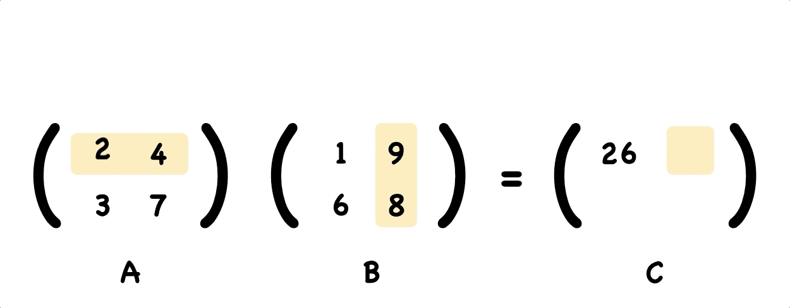

---
redirect_from:
  - "/03/matrix"
interact_link: content/03/Matrix.ipynb
kernel_name: python3
has_widgets: false
title: 'Matrix'
prev_page:
  url: /03/ForwardPropagation
  title: 'How the single pass through the network—Forward Propagation'
next_page:
  url: /03/ApplyMatrix
  title: 'Apply matrix to neural network computation'
comment: "***PROGRAMMATICALLY GENERATED, DO NOT EDIT. SEE ORIGINAL FILES IN /content***"
---

# Matrix

In mathematics, a **matrix** (plural: **matrices**) is a table, a rectangular array of numbers, symbols, or expressions, arranged in rows and columns. In python, we can use two-dimensional array to represent it.

For example, the dimension of the matrix below is 2 by 3, because there are two rows and three columns:


In Python, we usually use Numpy to represent and evaluate matrices.


{:.input_area}
```python
A = np.array([[2,4,5],[3,7,9]])
```


We use ndim funcation to get the dimension of the matrix:


{:.input_area}
```python
np.ndim(A)
```


{:.output .output_data_text}
```
2
```


Shown as the ouput, this is a two dimension matrix.

And we can use shape function to get shape:


{:.input_area}
```python
A.shape
```


{:.output .output_data_text}
```
(2, 3)
```


This is a 2 by 3 array matrix. 2 represent the number of rows, which means the first dimension has 2 elements. 3 represent the number of columns, which means the second dimension has 3 elements.

## Multiplying Matrixs

Now let's see how to multiple Matrix. When multiply a matrix by another matrix we need to do the **dot product** of rows and columns. Here’s an example of two simple matrixs A and B multiplied together.

To work out the top left element of the answer, let's take the dot product of first row of A and first column of B.

The **Dot Product** means multiply matching members, then sum up:

$$(2, 4) • (4, 6) = 2×4 + 4×6 = 26$$

We multiply first numbers 2 and 4, likewise for the second numbers 4 and 6, and finally sum them up.


Using the same way, we figure out the top right element of the answer.




That's easy right? Continuing work out the rest numbers by yourself.


Finally, we get the result matrix C.

Notice that we can’t multiply any two matrices, they need to be compatible, which means the number of columns in the first must be equal to the number of rows in the second.

This operation can be achieved using Numpy. We create two matrix A and B:


{:.input_area}
```python
A = np.array([[2,4],[3,7]])
print(A)
```


{:.output .output_stream}
```
[[2 4]
 [3 7]]

```


{:.input_area}
```python
B = np.array([[1,9],[6,8]])
print(B)
```


{:.output .output_stream}
```
[[1 9]
 [6 8]]

```

Then use **dot** operation to multiply them and assign the result to matrix C:


{:.input_area}
```python
C = np.dot(A,B)
print(C)
```


{:.output .output_stream}
```
[[26 50]
 [45 83]]

```
