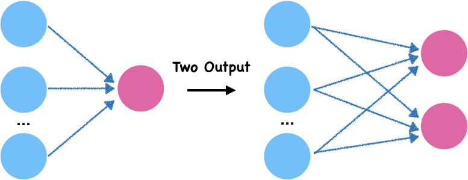
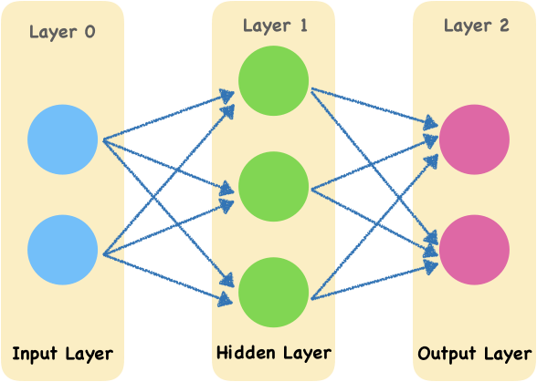

---
redirect_from:
  - "/03/multilayerperceptron"
interact_link: content/03/MultilayerPerceptron.ipynb
kernel_name: python3
has_widgets: false
title: '3. Multilayer Perceptron'
prev_page:
  url: /02/Iris
  title: 'Iris Classification'
next_page:
  url: /03/MultilayerPerceptron
  title: 'Multilayer Perceptron'
comment: "***PROGRAMMATICALLY GENERATED, DO NOT EDIT. SEE ORIGINAL FILES IN /content***"
---

# Multilayer Perceptron

## Multi Output Perceptron

In the last chapter, we learn about the single output perceptron. If we combine two or more perceptron, we can get a multi-output perceptron. In this way, we can build networks.

## Multilayer perceptron

Multilayer perceptron also named deep feedforward networks. It adds hidden layers to the previous perceptron.

Diagram 3.1 shows an example neural network. To keep the diagram clear, all the weights are unmarked. The leftmost layer 0 is the **input layer**. The rightmost layer 2 is the **output layer**. The middle layer 1 is called **hidden layer**. Here the input layer and output layer have 2 nodes and the hidden layer has 3 nodes. Although there are three layers, **only two of them has weight**, so we call this network as a two-layer network.

Why the middle layer is called a hidden layer? The data of the input layer and output layer are strictly observable, while the data value of the hidden layer is learned by the model. Therefore, we cannot see them in advance. They are "hidden" for us.

3.1 Neural Network

As shown in diagram 3.1, each node in the input layer is connected with the hidden layer, and each node in the hidden layer is connected with the output layer. We call hidden layer and output layer are **fully connection layer**.

## Reference

- [Deep Learning Book](http://www.deeplearningbook.org/contents/part_practical.html)
