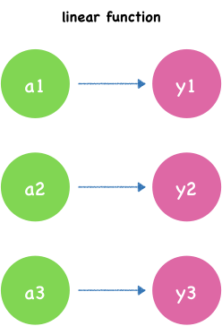
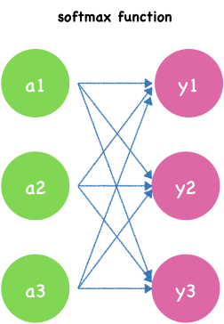

---
redirect_from:
  - "/03/outputlayer"
interact_link: content/03/OutputLayer.ipynb
kernel_name: python3
has_widgets: false
title: 'Design the Output Layer'
prev_page:
  url: /03/ApplyMatrix
  title: 'Apply matrix to neural network computation'
next_page:
  url: /04/Intro
  title: 'Training Neural Networks'
comment: "***PROGRAMMATICALLY GENERATED, DO NOT EDIT. SEE ORIGINAL FILES IN /content***"
---

# Design the Output Layer

Applying the same signal calculation flow between input layer and hidden layer, we can calculate signal between hidden layer and output layer.

The node in output layer's structure is the same as the hidden layer's node. However, the choose of the activate function is different according to difference types of questions. 

In machine learning, there are two kind of kinds of problems: **regression** and **classification**. The output values of classification problem are **categorical data**. The Iris classification problem we mentioned earlier falls into this category. While the output values of regression problem are **numerical data**. For example, let's support that we're going to predict what's the probability of rain tomorrow. The probability can be 29%, 29.3%, 98% and so on. It is a numerical value, so it's a regression problem.

For the regression, We can use the **linear function**. The simple one is identity activation function.

$$ f(x) = x $$



For the classification, **softmax** function is a good choose. It squashes the outputs of each unit to be between 0 and 1, and the sum of outputs values is equal to 1. Mathematically the softmax function is shown below.

$$y_{k} = \frac{e^{a^{k}}}{\sum_{i=1}^{n}e^{a^{i}}}$$

$y_k$ is the $kth$ node's output. $n$ is the number of nodes in output layer. $k$ indexes the output units, so $k = 1, 2, ..., n$.

Implementation in Python:


{:.input_area}
```python
import numpy as np
def softmax(a):
    c = np.max(a)
    exp_a = np.exp(a - c) # avoid overflow
    sum_exp_a = np.sum(exp_a)
    y = exp_a / sum_exp_a
    return y
```




Suppose we want to predict tomorrow's weather, which has three kinds: sunny, cloudy and rainy. Using softmax as activate function, the final outputs will be the probability of these three categories. For the example image above, the output of the softmax function might look like:


{:.input_area}
```python
a = np.array([1.83,0.96,0.4])
y = softmax(a)
y
```


{:.output .output_data_text}
```
array([0.60304157, 0.2526452 , 0.14431323])
```


For tomorrow's weather, the probability of sunny day is 0.605, cloudy day is 0.153 and rainy day is 0.144. So we forecast tomorrow might be a sunny day.

## Summary

1. Forward propagation sequentially calculates the intermediate variables of neural network from input layer to output layer.
2. Using matrix dot product make the calculation much more neat and powerful.
3. When designing the output layer, different activation functions should be selected according to different problems.

- https://en.wikipedia.org/wiki/Matrix_(mathematics)
- https://www.mathsisfun.com/algebra/matrix-multiplying.html
