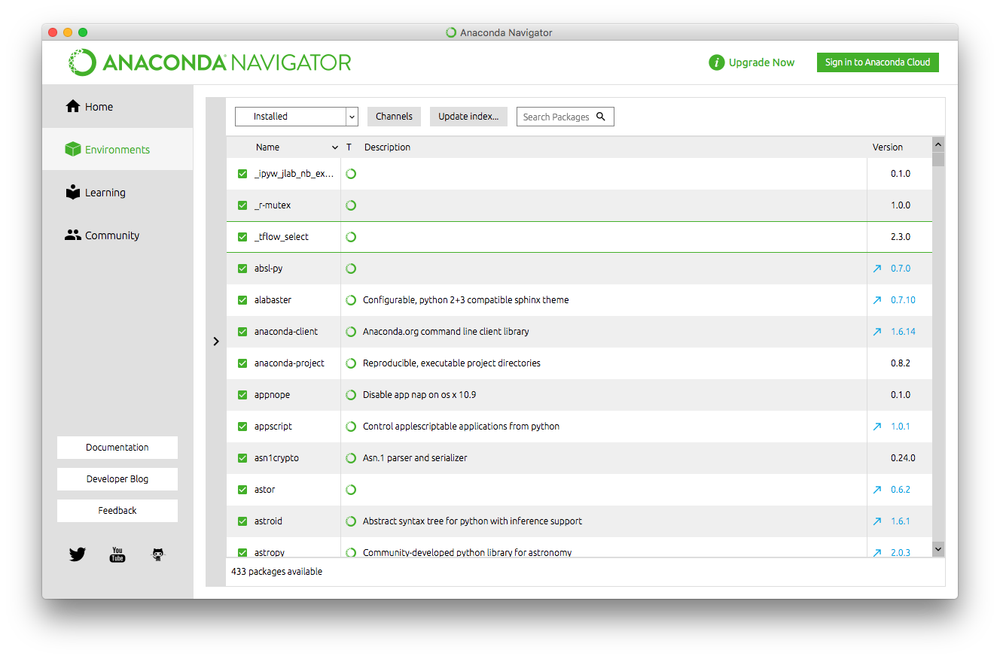
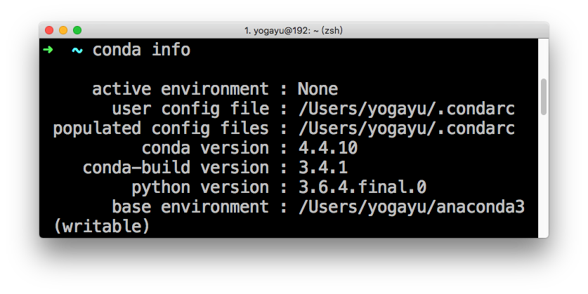
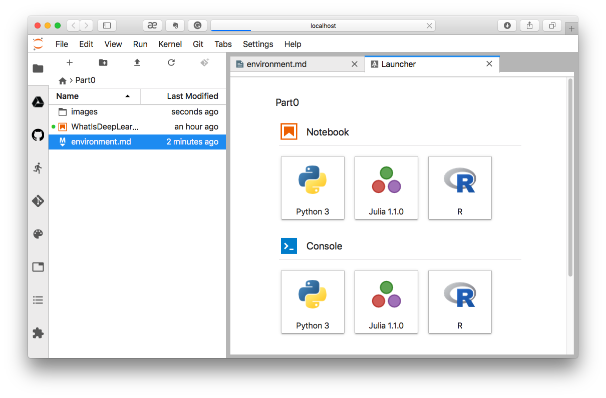

# Environment Setup

In this section we’ll setup the development environment needed in this course. I recommend Anaconda to manage Python Package and using Jupyter Lab to support interactive notebook.

## Anaconda

The open-source Anaconda Distribution is the easiest way to perform Python/R data science and machine learning on Linux, Windows, and Mac OS X. It ships with more than 1,000 data packages, the conda command-line tool and with a desktop graphical user interface called Anaconda Navigator.[^1]

It contains almost Packages we will use in this course, like scikit-learn, NumPy and pandas.

Download and install the version according to your computer operation system:

https://docs.anaconda.com/anaconda/install/

After installing, you can open Anaconda Navigator App.



In the environment tab, all the packages installed are listed.

Using `info` to check it installed:

```
conda info
```

Output:



### Create a new environment 

We will name the environment snowflakes and install the package BioPython. At the Anaconda Prompt or in your terminal window, type the following:

```
conda create --name snowflakes biopython
```

Conda checks to see what additional packages ("dependencies") Biopython will need, and asks if you want to proceed:
```
Proceed ([y]/n)? y
```
Type "y" and press Enter to proceed.
To use, or "activate" the new environment, type the following:
```
Windows: conda activate snowflakes
Linux and macOS: conda activate snowflakes
```

### Install a package into the current environment

```
conda install beautifulsoup4
```

Check to see if the newly installed program is in this environment:

```
conda list
```

## TensorFlow

TensorFlow is an end-to-end open source platform for machine learning. It has a comprehensive, flexible ecosystem of tools, libraries and community resources that lets researchers push the state-of-the-art in ML and developers easily build and deploy ML powered applications.[^2]

Install the TensorFlow 2.0 Alpha with a CPU version:

```
pip install tensorflow==2.0.0-alpha0
```

If your computer have great GPU, you can install the TensorFlow 2.0 Alpha with a GPU version:

```
pip install tensorflow-gpu  # stable
pip install tensorflow-gpu==2.0.0-alpha0
```

For more detail instructions, read this web page: 

https://www.tensorflow.org/install/pip

## Jupyter Lab

JupyterLab is a next-generation web-based interface developed by the Jupyter team for the Jupyter project. It is more integrated, flexible, and extensible than the Jupyter Notebook. It supports more than 100 kinds of languages, and supports for multiple documents mutual integration, which realizes the interactive computing new work process.[^3]


As we have installed conda, we use conda to install this package:

```
conda install -c conda-forge jupyterlab
```

Start up JupyterLab:

```
jupyter lab
```




For more detail instructions, please refer to this page:

http://data2art.com/Jupyterlab-en.html


## Reference

[^1]:https://conda.io/projects/conda/en/latest/user-guide/getting-started.html#managing-environments
[^2]:https://www.tensorflow.org/install
[^3]: https://jupyter.readthedocs.io/en/latest/