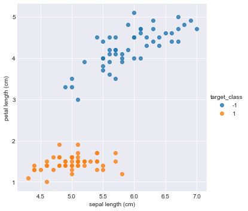
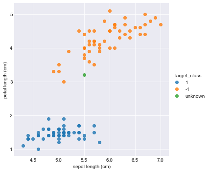
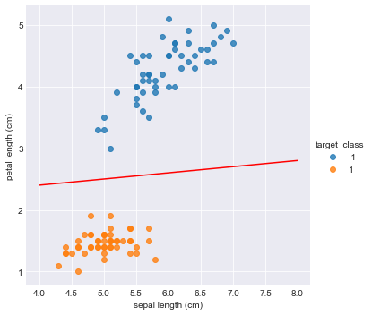

# Iris Flowers Classification


```python
# dataset
from sklearn import datasets
# plot
import seaborn as sns
sns.set_style("darkgrid")
import matplotlib.pyplot as plt
# data manipulation
import pandas as pd
import numpy as np
# To display image in the jupyter notebook cell
%matplotlib inline
```

## Question

How could machine learn from data? To answer this question, let's look at an example first: there is a data set witch consists two species of Iris, how to classify those two species? When given a new Iris, how to predict which Iris category it belongs to?

## Data Set

The data set we will use is modified from the Iris dataset which can be found on the [UCI Machine Learning Repository](https://archive.ics.uci.edu/ml/datasets/Iris/). It consists of 50 samples from each of **two species** of Iris (Iris setosa, Iris virginica). **Two features** were measured from each sample: the length of the sepals and petals, in centimeters.

Let's get a close look at the dataset.


```python
# read csv file
iris_dataset = pd.read_csv("iris_data.csv")
# show the first 5 lines
iris_dataset.head()
```


<div>
<style scoped>
    .dataframe tbody tr th:only-of-type {
        vertical-align: middle;
    }

    .dataframe tbody tr th {
        vertical-align: top;
    }
    
    .dataframe thead th {
        text-align: right;
    }
</style>

<table border="1" class="dataframe">
  <thead>
    <tr style="text-align: right;">
      <th></th>
      <th>sepal length (cm)</th>
      <th>petal length (cm)</th>
      <th>target_class</th>
    </tr>
  </thead>
  <tbody>
    <tr>
      <th>0</th>
      <td>5.1</td>
      <td>1.4</td>
      <td>1</td>
    </tr>
    <tr>
      <th>1</th>
      <td>4.9</td>
      <td>1.4</td>
      <td>1</td>
    </tr>
    <tr>
      <th>2</th>
      <td>4.7</td>
      <td>1.3</td>
      <td>1</td>
    </tr>
    <tr>
      <th>3</th>
      <td>4.6</td>
      <td>1.5</td>
      <td>1</td>
    </tr>
    <tr>
      <th>4</th>
      <td>5.0</td>
      <td>1.4</td>
      <td>1</td>
    </tr>
  </tbody>
</table>
</div>

The columns in this dataset are:
- sepal length in cm
- petal length in cm
- Species
    - target_class 1: setosa
    - target_class -1: versicolor


*Image source* [1](https://en.wikipedia.org/wiki/Iris_flower_data_set#/media/File:Iris_versicolor_3.jpg) [2](http://www.twofrog.com/images/iris38a.jpg)


## Classification

The following graph showing the measured sepal length and sepal length of Iris.


```python
sns.lmplot("sepal length (cm)", "petal length (cm)", data=iris_dataset,fit_reg=False,hue="target_class")
```


    <seaborn.axisgrid.FacetGrid at 0x10d5a8eb8>





I believe you can classify those two species category immediately.

Get back to our question: identify which category a new Iris belongs to?

Suppose the new Iris' sepal length is 5.5 cm and petal length is 3.2. We draw this new Iris point to the plot.


```python
new_iris_dataset = iris_dataset.append([{"sepal length (cm)":5.5, "petal length (cm)":3.2,"target_class":"unknown"}])
sns.lmplot("sepal length (cm)", "petal length (cm)", data=new_iris_dataset,fit_reg=False,hue="target_class")
```


    <seaborn.axisgrid.FacetGrid at 0x1a1f8fecf8>





The unknown dot is the new Iris. Obviously, it belongs to versicolor specie (target_clss=-1).

### Linear Classifier

This task is easy for us. We can classify them by eyes. Howevere, the computer doesn't has eyes, how can it split those two groups?

You may have noticed that this is a two-dimensional plane, and if  want to separate the two classes, we can put a line between them. It looks like the following plot.


```python
x = np.linspace(4,8,18)
a = 0.1
b = 2
y = a * x + b

sns.lmplot("sepal length (cm)", "petal length (cm)", data=iris_dataset,fit_reg=False,hue="target_class")
plt.plot(x, y, '-r')
```


    [<matplotlib.lines.Line2D at 0x1a1fc3fcc0>]





All the points above the line are setosa category(-1), and all the points below the line are versicolor category(1). When a new Iris comes, a computer can predict which category it falls into by deciding whether it is above or below the line. 

Therefore, **if we can teach computer to find such a kind of line, we can solve our problem!** Let's do it.

In formal, a line in a two-dimensional plane can be represent as following:

$$ax + by + c = 0 $$

let:

$$w_0 = c$$
$$w_1 = a$$
$$w_2 = b$$


then it becomes:

$$w_1x + w_2y + w_0 = 0$$

Therefore, in mathematics form, all points above the line are:

$$w_1*x + w_2*y + w_0 > 0$$

and all points below the line are:

$$w_1*x + w_2*y + w_0 < 0$$

Because $f(x,y)$ is a linear function, we call it **a linear classifier**. To find a appropriate linear classifier of Iris, we need to find suitable $w_0,w_1$, and $w_3$.

In next section, we will learn about how to use "Perceptron Learning Algorithm" to find those parameters.

## Reference
- [Iris data set](https://archive.ics.uci.edu/ml/datasets/Iris/)
- [perceptron introduction](https://medium.com/jameslearningnote/資料分析-機器學習-第3-2講-線性分類-感知器-perceptron-介紹-84d8b809f866)
