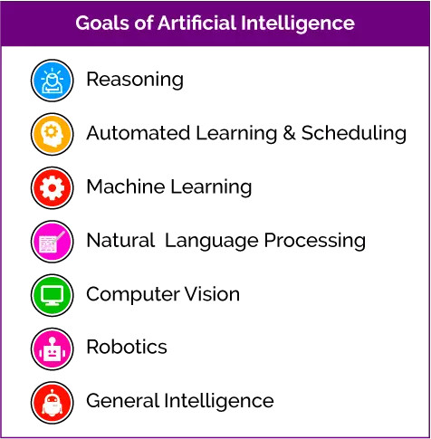

# Part 1 Introduction

> Can machines think? —— **A. M. Turing**[^1]

#### What is Deep Learning?

AI->ML->DL

感知-学习-行动

### Artificial Intelligence

什么是人工智能。

我们人类拥有自然的智能。

你在很小的时候，就能学会说话，学会行走。随着对这个世界的进一步认知，你能够开始思路世界中存在的一些关系。你能够感知到你身边人的情绪。这一些都是我们人拥有的智能。

你可以学会很多技能，

感知，语言，记忆，学习，决策。

语言能力，推理能力，情绪等等，这些都是我们人的智能。

而长久以来，科学家们都希望能够制造出，拥有人类智能的机器。也就是人工智能。




核心而言，计算机能做的只有计算。

那为什么计算机能够在围棋上打败人类？为什么可以自动在道路上驾驶？为什么。。。？

初看时，人工智能及强大，又带着些许神秘。


What is human intelligence?

You learned how to talk when you  are a little baby.

Then you can walk.


Plan

We can plan, we know what we are goning to do tomorrow.


Emotion

When your friend get a big price, you feel happy.


Why?

Find the reason behand the event. 

When you see a picture, you can tell there is a cat.

When something happened, you can think about the reason.


How can a machine beat the world's best go player? How can siri understand what you are saying and respond to you?  How can the machine drive itself on the road? How could the data science team help Obama win the presidency? Why YouTube know which video you want to watch? 


In essence, a computer can do noting but compute. How could those things being possible？


In [computer science](https://en.wikipedia.org/wiki/Computer_science),  **artificial intelligence** (**AI**), sometimes called **machine intelligence**, is [intelligence](https://en.wikipedia.org/wiki/Intelligence) demonstrated by [machines](https://en.wikipedia.org/wiki/Machine), in contrast to the **natural intelligence** displayed by humans and animals. Colloquially, the term "artificial intelligence" is used to describe machines that mimic "cognitive" functions that humans associate with other [human minds](https://en.wikipedia.org/wiki/Human_mind), such as "learning" and "problem solving".[[1\]](https://en.wikipedia.org/wiki/Artificial_intelligence#cite_note-FOOTNOTERussellNorvig20092-1) WIKI


We want to build  machines which have human intelligence.

So Artificial intelligence(AI) is [intelligence](https://en.wikipedia.org/wiki/Intelligence) demonstrated by [machines](https://en.wikipedia.org/wiki/Machine).


We, human benings, want to build a machine which has **human intelligence**.


Most of you, are way more smarter than the computer. 


Why it related to our real life?

Communication

Recommend system, intelligence customer service

Draw, writing potes, Siri

AlphaGo, AlphaZero

### Machine Learning

机器学习是人工智能的一个分支。 

构建一个映射函数，使得其有从数据中学习的能力。


data → machine learning → skill

observations → learning → skill

with experience accumulated from observations.


怎么定义一只猫？

给计算机看各种各样猫咪的图片，通过某种映射的方法，计算机从中找出规律，从而学习到什么是猫。

我们在开车时，知道一系列关于如何驾驶的规则，调节方向盘转弯，踩哪里是刹车。并且，我们能够感知这个世界，例如，现在是否是红绿灯，前面如果有行人，需要停车等行人通过。

从数据中学习知识。

对于计算机而言，如果通过半径求得圆的面积，十分简单。我们只要编写指令。对于人类而言，非常复杂庞大的计算，计算机都可以不遗余力，日夜兼程的快速计算。(ML 相关吗？)

```python
import math
r = 21.43
area = math.pi * r**2
```


We learn from experience.

With experience accumulated from observations.


**Machine learning** (**ML**) is the [scientific study](https://en.wikipedia.org/wiki/Branches_of_science) of [algorithms](https://en.wikipedia.org/wiki/Algorithm) and [statistical models](https://en.wikipedia.org/wiki/Statistical_model) that [computer systems](https://en.wikipedia.org/wiki/Computer_systems) use in order to perform a specific task effectively without using explicit instructions, relying on patterns and inference instead. It is seen as a subset of [artificial intelligence](https://en.wikipedia.org/wiki/Artificial_intelligence). 


Machine learn from the data.

with experience accumulated/computed from observations.


“when I was a teenager struggling to work out how these powerful yet mysterious neural networks worked. ” 摘录来自: Rashid, Tariq. “Make Your Own Neural Network。” iBooks. 

### Deep Learning

**Deep learning** (also known as **deep structured learning** or **hierarchical learning**) is part of a broader family of [machine learning](https://en.wikipedia.org/wiki/Machine_learning) methods based on artificial neural networks. Learning can be [supervised](https://en.wikipedia.org/wiki/Supervised_learning), [semi-supervised](https://en.wikipedia.org/wiki/Semi-supervised_learning) or [unsupervised](https://en.wikipedia.org/wiki/Unsupervised_learning).[[1\]](https://en.wikipedia.org/wiki/Deep_learning#cite_note-BENGIO2012-1)[[2\]](https://en.wikipedia.org/wiki/Deep_learning#cite_note-SCHIDHUB-2)[[3\]](https://en.wikipedia.org/wiki/Deep_learning#cite_note-NatureBengio-3)

https://en.wikipedia.org/wiki/Deep_learning

Hand engineered features are time consuming, brittle and not scalable in practice
Can we learn the underlying features directly from data?


MIT Course

Deep Learning is a subfield of machine learning concerned with algorithms inspired by the structure and function of the brain called artificial neural networks.

## Reference

[^1]: https://www.csee.umbc.edu/courses/471/papers/turing.pdf